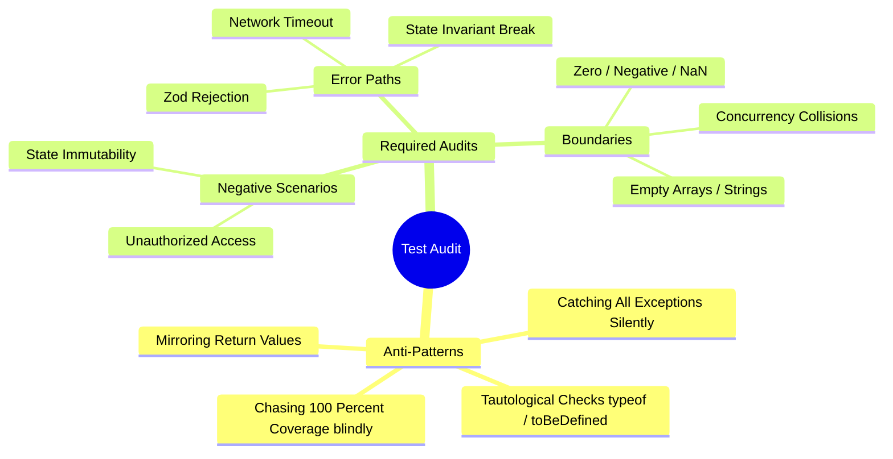

# AI Specification-First & Test Integrity Audit Protocol

Enforces a rigorous quality control framework for AI-assisted engineering. Inverts the traditional generation flow by defining expected behaviors, invariant rules, and edge cases **before** requesting AI implementations. Eliminates the **AI Test Mirroring Anti-Pattern** (where AI generates tests matching buggy code, locking bugs as expected behavior) and replaces vanity coverage metrics with deep assertion reviews of error paths and boundaries.

---

## Purpose

- **Prevent Bug-Locking**: Stop AI from generating post-hoc tests that treat implementation bugs as intentional features.
- **Enforce Inverted Development**: Shift from *"Code first → Test later"* to *"Contract & Edge Cases first → AI implements → Human audits assertions"*.
- **Focus on High-Impact Paths**: Audit critical error paths and boundary conditions rather than chasing arbitrary coverage percentages.
- **Standardize Verification**: Provide executable acceptance criteria before any code is generated.

---

## Architectural Flow: Post-Hoc Trap vs Inverted Spec-First

```mermaid
flowchart TD
    subgraph AntiPattern["❌ Flawed Post-Hoc Mirroring Trap"]
        A1["1. AI Generates Code\n(Contains edge-case bug)"] --> B1["2. AI Writes Tests Post-Hoc"]
        B1 --> C1["3. AI Mirrors Flawed Output\ninto expect() assertions"]
        C1 --> D1["4. Tests Pass (100% Coverage)\n⚠️ Bug Locked as Expected Behavior!"]
    end

    subgraph SpecFirstPattern["✅ Inverted Spec-First Protocol"]
        A2["1. Define Expected Behaviors\n& Edge Cases (Human/Spec)"] --> B2["2. Draft Executable Acceptance Tests\n(bun test - Fails Red)"]
        B2 --> C2["3. AI Generates Implementation\nto satisfy Acceptance Criteria"]
        C2 --> D2["4. Manual Assertion Audit:\nBoundary & Error Paths"]
        D2 --> E2["5. Tests Pass Verified Green\n🛡️ High-Integrity Delivery"]
    end

    style AntiPattern fill:#ffebee,stroke:#c62828,stroke-width:2px
    style SpecFirstPattern fill:#e8f5e9,stroke:#2e7d32,stroke-width:2px
```



---

## Core Rules & Principles

> [!IMPORTANT]
> **RULE 1: INVERTED FLOW (SPEC & EDGE CASES FIRST)**
> Never ask AI to generate implementation code without first establishing the explicit contract: input expectations, invariant states, return types, and failure modes. Tests serve as executable acceptance criteria.

> [!WARNING]
> **RULE 2: ZERO POST-HOC TEST GENERATION (ANTI-MIRRORING)**
> Do not ask AI to generate unit tests *after* reviewing or writing code without an independent specification. When an AI generates tests against existing code, it naturally assumes the current code behavior is correct—permanently locking hallucinations and edge-case errors.

> [!CAUTION]
> **RULE 3: MANDATORY MANUAL ASSERTION AUDIT**
> All test assertions (`expect()`, `toBe()`, `toThrow()`, `rejects`) must be manually audited by an engineer, specifically examining:
> 1. **Error paths**: Are exceptions, status codes, and error payloads accurately asserted?
> 2. **Boundary conditions**: Are `0`, `-1`, `MAX_INT`, empty arrays `[]`, `null`, `undefined`, and off-by-one states verified?
> 3. **Tautological assertions**: Ensure assertions are not trivial (e.g., asserting `typeof x === 'object'` instead of strict values).

> [!TIP]
> **RULE 4: VALUE OVER VANITY COVERAGE**
> Do not pursue 100% line coverage as a target metric. 10 meaningful assertions covering hostile edge cases and error states provide exponentially higher reliability than 100 lines of AI-mirrored happy-path execution.

---

## Audit Workflow Phases

### Phase 1: Contract & Edge-Case Definition
Before generating any implementation code, document the specification:

1. **Happy Path Invariants**: What must the function/component guarantee when inputs are valid?
2. **Boundary Matrix**:
   - Empty/Null/Undefined inputs (`""`, `[]`, `{}`, `null`, `undefined`, `NaN`)
   - Numerical limits (zero, negative, max buffer size, precision boundaries with `decimal.js`)
   - State transition boundaries (unauthenticated, disconnected, expired tokens)
3. **Error Paths & Failure Modes**:
   - Network failure / API timeout
   - Invalid schema / validation rejection (e.g., Zod parse failures)
   - Concurrency / race conditions

---

### Phase 2: Acceptance Criteria Test Drafting (Red State)
Create or review test suites before implementation:

```typescript
// Example: tests/services/export-screenplay.test.ts
import { describe, expect, it } from "bun:test";
import { exportScreenplay } from "@/services/screenplay";

describe("exportScreenplay() [Acceptance Criteria]", () => {
  // 1. Happy Path
  it("should generate valid docx buffer when scenes are properly structured", async () => {
    const input = { id: "sc-1", scenes: [{ title: "Scene 1", dialogue: "Hello" }] };
    const result = await exportScreenplay(input);
    expect(result).toBeInstanceOf(Buffer);
    expect(result.length).toBeGreaterThan(0);
  });

  // 2. Boundary Condition (Empty Scenes)
  it("should throw EmptySceneError when scenes array is empty []", async () => {
    const input = { id: "sc-2", scenes: [] };
    expect(exportScreenplay(input)).rejects.toThrow("Scenes list cannot be empty");
  });

  // 3. Error Path (Invalid Schema / Malformed Data)
  it("should reject with ZodError when scene dialogue is missing or malformed", async () => {
    const malformed = { id: "sc-3", scenes: [{ title: 123 }] } as any;
    expect(exportScreenplay(malformed)).rejects.toThrow();
  });
});
```

---

### Phase 3: AI Implementation & Green Cycle
1. Supply the AI with the acceptance criteria / tests.
2. Instruct AI to generate the minimum viable implementation to satisfy the test specifications.
3. Run test runner:
   ```bash
   bun test
   ```

---

### Phase 4: Manual Assertion Audit (Anti-Mirroring Inspection)
Inspect the codebase and test files against the **Assertion Integrity Checklist**:

| Audit Dimension | Verification Criteria | Status |
| :--- | :--- | :---: |
| **Mirroring Check** | Did the test assertion originate from external requirements or does it just mirror the return value of the code? | 🔍 |
| **Error Path Specificity** | Does `toThrow()` check specific error types or error messages rather than generic catches? | 🔍 |
| **Boundary Extremes** | Are off-by-one indices, zero lengths, empty strings, and null states tested? | 🔍 |
| **Negative Testing** | Does the test verify what the code **must NOT** do (e.g. not mutating state, not calling unneeded APIs)? | 🔍 |
| **False-Positive Prevention** | If the implementation is intentionally broken, do the tests immediately fail? | 🔍 |

---

### Phase 5: Mutation & Integrity Verification
To prove assertions are not falsely passing:
1. **Mutation Check**: Temporarily invert a condition in the code (e.g. change `if (len > 0)` to `if (len >= 0)`).
2. **Execute Tests**:
   ```bash
   bun test
   ```
3. If tests still pass after mutating code logic, **the assertion is flawed** and must be rewritten.

---

## Assertion Audit Matrix & Red Flags



### Common Mirroring Red Flags
- ❌ `expect(res.status).toBeDefined()` *(Weak assertion)*
- ❌ `expect(res).toEqual(await buggyFunction())` *(Mirroring implementation behavior)*
- ❌ `expect(result.data).toBeTruthy()` when `result.data` could contain error payload
- ✅ `expect(res.status).toBe(400)` & `expect(res.body.code).toBe("INVALID_SCENE_ID")`
- ✅ `expect(state.scenes).toHaveLength(0)` *(Explicit invariant check)*

---

## Audit Report Template

When conducting an AI Code & Test Integrity Audit, generate the following report:

```markdown
# 🛡️ AI Test Integrity & Specification Audit Report

## 1. Executive Summary
- **Module / Feature**: `[Component / Service Name]`
- **Audit Verdict**: `[APPROVED / REVISE ASSERTIONS / REJECTED (MIRRORING DETECTED)]`
- **Total Assertions Reviewed**: `[Count]`
- **High-Risk Error/Boundary Paths Verified**: `[Count]`

## 2. Invariant & Boundary Verification Matrix
| Target Function / Endpoint | Boundary Case Tested | Error Path Tested | Assertion Quality | Mirroring Risk |
| :--- | :--- | :--- | :--- | :--- |
| `exportScreenplay()` | Empty scenes `[]` | Malformed Schema | High (Explicit Error) | 🟢 None |
| `updateSceneOrder()` | Index `-1`, Index `> len` | Concurrency lock | High (Strict State) | 🟢 None |

## 3. Detected Anti-Patterns & Remediations
> [!WARNING]
> **Finding 1**: Test `shouldHandleError` mirrored fallback return value `{ success: false }` instead of asserting specific `ValidationError`.
> - **Remediation**: Updated assertion to `expect(...).rejects.toThrow(ValidationError)`.

## 4. Verification Command
\`\`\`bash
bun test tests/path/to/target.test.ts
\`\`\`
```

---

## Usage

Run this workflow whenever designing new features, refactoring critical services, or reviewing AI-generated code:

```text
/ai-spec-first-audit
```

Or trigger manually during prompt reviews:
> *"Audit test assertions pada service ini untuk memastikan tidak ada AI mirroring anti-pattern"*
> *"Review boundary conditions dan error path sebelum implementasi dibuat"*

---

*AI Specification-First & Test Integrity Audit Workflow v1.0.0 — Updated 2026-08-29*
