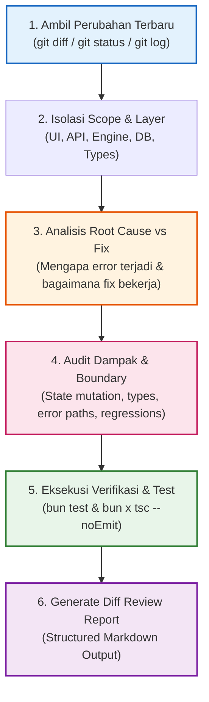
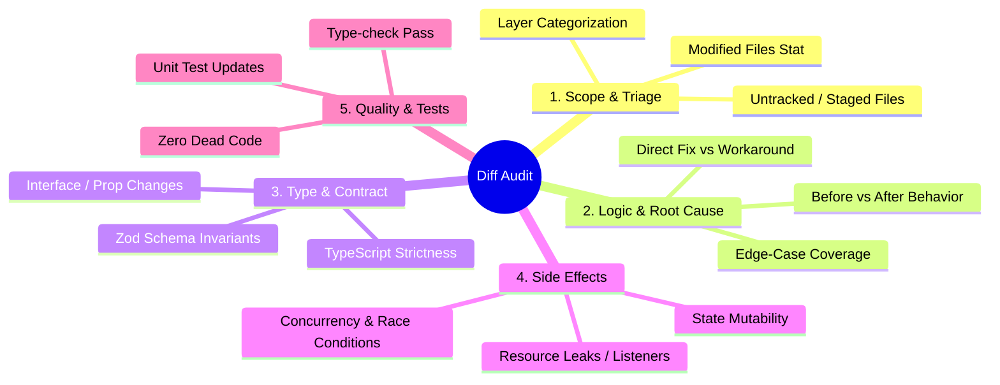

# Diff Review & Patch Analysis Protocol

Protokol standar untuk menganalisis, membedah, dan memvalidasi **diff (perubahan kode terbaru)** yang dihasilkan dari perbaikan bug, refactoring, atau patch fungsional. Protokol ini memastikan developer dan AI Agent memahami secara mendalam *akar masalah (root cause)*, *mekanisme perbaikan*, *potensi efek samping (side-effects)*, dan *integritas pengujian* sebelum perubahan diintegrasikan atau di-commit.

---

## Purpose

- **Intent vs. Reality Verification**: Memverifikasi apakah perubahan kode benar-benar menyelesaikan masalah inti tanpa mengubah perilaku yang tidak diinginkan.
- **Side-Effect & Regression Prevention**: Mendeteksi potensi regresi pada modul hulu/hilir, mutasi state tersembunyi, kebocoran memori, atau pelanggaran kontrak API/tipe.
- **Deep Boundary & Error Path Audit**: Memastikan penanganan kondisi batas (`null`, `undefined`, `[]`, `0`, off-by-one) dan error handling tetap tangguh.
- **Structured Knowledge Synthesis**: Menghasilkan ringkasan teknis yang jernih, actionable, dan mudah dipahami oleh reviewer atau tim engineering.

---

## Architectural Flow: End-to-End Diff Review



---

## Core Rules & Guardrails

> [!IMPORTANT]
> **RULE 1: NEVER TRUST SYNTAX WITHOUT SEMANTICS**
> Jangan hanya membaca baris yang ditambah (`+`) atau dihapus (`-`). Pahami **alasan semantik** di balik setiap baris perubahan: Mengapa variabel ini diubah? Mengapa kondisi `if` diperketat? Apakah ada asumsi tersembunyi yang berubah?

> [!WARNING]
> **RULE 2: TRACE THE RIPPLE EFFECT (DOWNSTREAM AUDIT)**
> Setiap perubahan pada return type, interface, signature fungsi, atau global state pasti berdampak pada komponen pemanggil (*callers/consumers*). Wajib menelusuri seluruh file yang mengonsumsi modul yang dimodifikasi.

> [!CAUTION]
> **RULE 3: BOUNDARY & LOCAL-FIRST INTEGRITY**
> Periksa apakah perbaikan mengorbankan prinsip arsitektur utama:
> 1. Apakah ada data media lokal yang tidak sengaja bocor ke cloud?
> 2. Apakah ada nilai `null`/`undefined` yang diabaikan dengan *non-null assertion* (`!`) atau casting tidak aman (`as any`)?
> 3. Apakah race condition pada operasi async / event listener telah ditangani dengan teardown yang benar?

> [!TIP]
> **RULE 4: PROOF BY VERIFIED EXECUTION**
> Diff perbaikan kode dianggap valid **hanya jika** didukung oleh eksekusi test nyata (`bun test`) dan validasi static type checker (`bun x tsc --noEmit`) tanpa error.

---

## Step-by-Step Inspection Protocol



### Phase 1: Ekstraksi & Kategorisasi Diff
Kumpulkan cakupan perubahan yang sedang aktif di working tree atau commit terbaru:

```bash
# 1. Cek ringkasan file yang berubah
git status -s

# 2. Cek statistik baris penambahan / penghapusan
git diff --stat

# 3. Baca diff lengkap dengan context baris yang memadai
git diff -U5

# 4. Jika meninjau commit terakhir
git show --stat --oneline HEAD
```

**Kelompokkan file berdasarkan layer arsitektur:**
- **UI / Presentation**: React components, hooks, styling, modals.
- **Backend / API**: Hono route handlers, middleware, request validation.
- **Core Engine / Media**: FFmpeg command builder, media probe, audio analysis.
- **Data / Storage**: SQLite schema, queries, migration, JSON stores.
- **Contracts / Types**: Definisi TypeScript interface, types, enums.

---

### Phase 2: Analisis Root Cause & Mekanisme Perbaikan
Jawab 3 pertanyaan fundamental untuk setiap modul yang diperbaiki:

1. **Problem Baseline**: Apa bug / kegagalan spesifik yang terjadi sebelum kode ini diperbaiki? (Misal: uncaught exception saat transkrip kosong, video playback desync, off-by-one cut timestamp).
2. **Fix Mechanism**: Bagaimana kode baru mengatasi masalah tersebut? Apakah dengan menambahkan defensive guard, memperbaiki algoritma pencarian, atau merestrukturisasi state?
3. **Fix Category**:
   - 🟢 **Direct Root-Cause Resolution**: Mengatasi sumber masalah pada intinya.
   - 🟡 **Defensive Guard**: Menambahkan fallback/guard tanpa mengubah struktur data yang rapuh.
   - 🔴 **Band-Aid / Anti-Pattern**: Membungkam error dengan `try-catch` kosong atau `as any`. *(Wajib ditolak/diperbaiki!)*

---

### Phase 3: Audit Dampak & Verifikasi Boundary
Lakukan audit mendalam terhadap checklist risiko berikut:

| Dimensi Audit | Pertanyaan Verifikasi | Indikator Risiko Tinggi ⚠️ |
| :--- | :--- | :--- |
| **Type Safety** | Apakah tipe data tetap ketat tanpa `any` atau `as unknown`? | Penggunaan casting paksa `as any` atau `// @ts-ignore` |
| **Null / Undefined** | Bagaimana perilaku saat input bernilai `null`, `undefined`, `""`, atau `[]`? | Asumsi array selalu terisi (`arr[0].id` tanpa pengecekan) |
| **State & Lifecycle** | Apakah ada potensi stale closure, loop re-render, atau memory leak? | `useEffect` missing dependencies atau lupa `cleanup()` |
| **Async / Race** | Apakah operasi async berurutan dapat bertabrakan? | State update terjadi setelah komponen unmounted tanpa abort |
| **Error Propagation** | Apakah error di-log dengan structured logger (Pino) dan trace ID? | `catch (e) {}` tanpa log atau hanya `console.log` |

---

### Phase 4: Validasi dan Eksekusi Otomatis
Jalankan validasi komprehensif untuk membuktikan tidak ada regresi:

```bash
# 1. Jalankan seluruh unit test suite
bun test

# 2. Jalankan test spesifik pada modul yang dimodifikasi
bun test tests/xclips/target-module.test.ts

# 3. Jalankan Type-Checking ketat
bun x tsc --noEmit
```

---

## Diff Review Report Template

Ketika selesai menganalisis diff perbaikan kode, sajikan laporan audit terstruktur menggunakan format berikut:

```markdown
# 🔍 Code Diff & Patch Review Report

## 1. Executive Summary
- **Target Scope**: `[Nama Modul / Fitur / File yang diubah]`
- **Review Verdict**: `[APPROVED / NEEDS REVISION / BLOCKED (REGRESSION DETECTED)]`
- **Files Modified**: `[X]` files (`+[Y]` lines, `-[Z]` lines)
- **Primary Objective**: `[1-2 kalimat ringkasan tujuan perbaikan]`

## 2. Change Breakdown & Root Cause Analysis
| File & Line Reference | Issue Before Patch | Solution Mechanism | Quality Rating |
| :--- | :--- | :--- | :---: |
| `[src/path/file.ts:L20-45]` | Deskripsi bug awal | Cara fix bekerja | 🟢 High / 🟡 Med |

## 3. Deep Impact & Boundary Evaluation
- **Type Safety**: `[Aman / Ada casting]`
- **Boundary Handling**: `[Telah diverifikasi untuk input kosong/nol/ekstrem]`
- **Downstream Consumers**: `[Daftar komponen pemanggil yang aman/terdampak]`
- **Side-Effects / Regressions**: `[Tidak ditemukan / Ditemukan potensi issue X]`

## 4. Code Snippet Comparison (Key Changes)
\`\`\`diff
- // Kode lama yang bermasalah
+ // Kode baru hasil perbaikan dengan guard ketat
\`\`\`

## 5. Automated Verification Results
- **Type Check (`tsc`)**: `[PASSED (0 errors)]`
- **Unit Tests (`bun test`)**: `[X passed, 0 failed]`

## 6. Actionable Recommendations
- `[Rekomendasi 1 jika ada penyempurnaan lebih lanjut]`
```

---

## CLI Recipes for Diff Investigation

```bash
# Melihat diff hanya untuk file staged
git diff --staged

# Melihat diff dengan mengabaikan perubahan whitespace
git diff -w

# Melihat ringkasan commit terakhir beserta pesan dan statistik
git log -n 1 --stat -p

# Meninjau perubahan pada file tertentu saja
git diff HEAD~1 -- path/to/specific-file.ts

# Mencari kata kunci tertentu di seluruh riwayat diff
git log -S "functionName" --source --all
```

---

## Usage

Jalankan workflow ini saat diminta mereview perubahan kode, memeriksa hasil bugfix, atau sebelum melakukan commit:

```text
/diff-review
```

Atau instruksikan secara natural dalam percakapan:
> *"Tolong review diff perubahan terbaru dari perbaikan fungsi ini"*
> *"Analisis apa saja yang berubah pada patch terakhir dan apakah ada potensi regresi"*
> *"Jelaskan perbaikan kode ini secara detail sebelum kita commit"*

---

*Diff Review & Patch Analysis Protocol v1.0.0 — Updated 2026-08-29*
