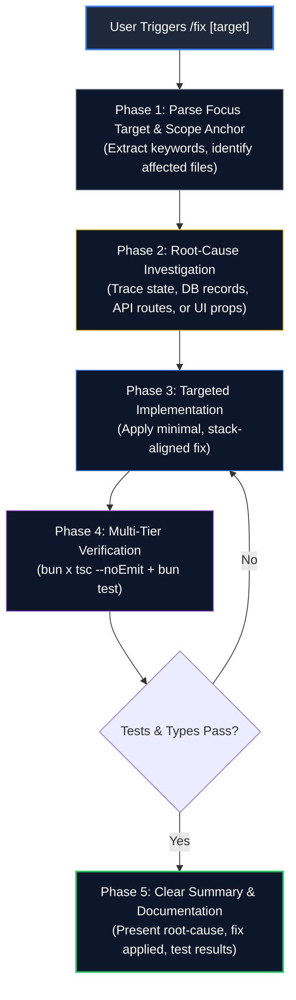

# Targeted Bug Fix & Remediation Protocol (`/fix`)

Provides a rigorous, stack-aligned protocol for diagnosing, isolating, and fixing issues in **xClips**. Every `/fix` execution is anchored strictly on the target description provided by the user (e.g., `/fix bagian [deskripsi masalah]`), ensuring laser-focused remediation with minimal blast radius, zero drift, and comprehensive validation.

---

## 🎯 Purpose & Scope

- **Laser-Focused Priority**: The phrase or clause following `/fix` (e.g., `/fix bagian subtitle dropdown`) is the **primary directive**. All investigations, code modifications, and verifications must center directly on this focus target.
- **Stack-Aligned Engineering**: Implement fixes tailored precisely to xClips architecture:
  - **Frontend**: Next.js 16 App Router, React 19, MUI v9 (`@mui/material`, `@mui/icons-material`), Zustand Studio Store (`useStudioStore.ts`).
  - **Backend / API**: Hono server on port `3351` (`src/server/index.ts`, `src/lib/xclips.service.ts`).
  - **Database & Storage**: SQLite WAL mode via native `bun:sqlite` (`vault/xclips/xclips.db`, `xclips-db.ts`).
  - **Media Pipeline**: Local-first binaries (`ffmpeg`, `ffprobe`, `yt-dlp`), VFR detection, ASS subtitle filters.
  - **AI Integration**: Gemini Flash / Kie AI / OpenAI transcribe and viral clip generation.
- **Zero Side-Effects & Zero Drift**: Modify only the necessary files directly linked to the target issue. Avoid touching unrelated components, layouts, or schemas.
- **Multi-Tier Verification**: Verify every fix using TypeScript type checking (`bun x tsc --noEmit`) and the native Bun test suite (`bun test`).
- **Zero Auto-Commit**: Changes remain in staging/working tree for user review.

---

## 🔄 Remediation Workflow Lifecycle



---

## 🛡️ Core Principles & Guardrails

> [!IMPORTANT]
> **RULE 1: PROMPT PRIORITY RULE (FOCUS ANCHOR)**
> The text provided after `/fix` is the absolute primary anchor. For example, if the prompt is `/fix dropdown subtitle tidak muncul`:
> - **Primary Focus**: The subtitle dropdown component, its state source, and its data feeding logic.
> - **Forbidden**: Refactoring unrelated video timelines, modifying clip export settings, or adding unsolicited features.

> [!WARNING]
> **RULE 2: ROOT-CAUSE INVESTIGATION OVER SUPERFICIAL PATCHES**
> Do not apply cosmetic patches that mask underlying state or data issues. Always trace the complete data pipeline:
> 1. **Data Layer**: SQLite row state (`vault/xclips/xclips.db`) & schema constraints.
> 2. **Service / API Layer**: Hono endpoint response & transform functions.
> 3. **Store Layer**: Zustand store actions, selectors, and subscribers.
> 4. **UI Layer**: React component props, event handlers, and MUI styling.

> [!CAUTION]
> **RULE 3: MINIMAL BLAST RADIUS (LOCALIZED CHANGES)**
> Keep edits as small and targeted as possible. Do not rewrite entire files when a targeted 5-line edit resolves the issue. Preserving existing code structure prevents regression bugs in production.

> [!TIP]
> **RULE 4: LOCAL-FIRST & ZERO-DRIFT MEDIA INTEGRITY**
> When fixing media/transcription issues, ensure heavy video processing stays 100% local via native CLI binaries (`ffmpeg`, `ffprobe`, `yt-dlp`). Do not send raw video files to external cloud APIs.

---

## 📋 Step-by-Step Execution Protocol

### Phase 1: Parse Focus Target & Isolate Scope
1. **Identify the Core Subject**: Parse the user's prompt to determine what component, API, or data model is failing.
2. **Map to Codebase Architecture**:
   - **UI / Component issues**: Look in `src/app/xclips/studio/` (`tabs/`, `modals/`, `components/`, `hooks/`).
   - **State / Reactivity issues**: Look in `src/app/xclips/studio/store/useStudioStore.ts`.
   - **API / Backend issues**: Look in `src/server/index.ts` and `src/lib/xclips.service.ts`.
   - **Database / Schema issues**: Look in `src/lib/xclips/xclips-db.ts` and `src/lib/xclips/types.ts`.
   - **Media / FFmpeg issues**: Look in `src/lib/xclips/ffmpeg-builder.ts`, `vfr-probe.ts`, `ytdlp-downloader.ts`.

### Phase 2: Root-Cause Investigation
1. **Inspect Active Code & Data**:
   - Use `view_file` or `grep_search` to inspect relevant logic and imports.
   - For database issues, query `vault/xclips/xclips.db` directly to inspect actual table data.
2. **Identify Invariant Breaks**:
   - Check for undefined props, mismatched types, missing event handlers, or unhandled null/empty states.
   - Check error handling and structured logs (`logs/app.log`, `logs/error.log`).

### Phase 3: Targeted Implementation
1. **Apply Surgical Edits**:
   - Use `replace_file_content` to modify only the targeted sections.
   - Ensure all MUI v9 components match the dark studio theme (`#121216`, `#18181c`, `#27272a`, `#3b82f6`).
   - Ensure TypeScript interfaces in `types.ts` strictly match database models and API contracts.
2. **Handle Edge Cases & Error Boundaries**:
   - Guard against empty arrays `[]`, `null`, `undefined`, NaN, or unexpected status responses.

### Phase 4: Multi-Tier Verification
1. **Type Checking**:
   Run TypeScript compilation check:
   ```bash
   bun x tsc --noEmit
   ```
2. **Automated Unit Tests**:
   Run the full Bun test suite:
   ```bash
   bun test
   ```
   Or run the specific affected test file:
   ```bash
   bun test tests/xclips/xclips-db.test.ts
   bun test tests/xclips/ffmpeg-builder.test.ts
   bun test tests/xclips/filler-detector.test.ts
   bun test tests/xclips/transcript-chunker.test.ts
   bun test tests/xclips/ytdlp-downloader.test.ts
   ```
3. **Assertion Verification**:
   Ensure all tests pass with 0 failures before reporting completion.

### Phase 5: Clear Summary & Documentation
Provide a concise, structured response containing:
- **Root Cause**: What was causing the issue based on the user's focus target.
- **Fix Applied**: Summary of the changes made (with clickable file links).
- **Test Results**: Output status of `tsc` and `bun test`.

---

## 💡 Usage Examples

### Example 1: UI / Dialog Fix
```text
/fix dialog generate subtitle: hapus subtitle teks deskripsi dan buat track label otomatis Track-1, Track-2
```
*Agent will focus exclusively on `GenerateSubtitleModal.tsx`, removing the description and adding sequential track label auto-fill.*

### Example 2: API / Store Fix
```text
/fix tombol switch subtitle tidak me-refresh kata-kata pada timeline
```
*Agent will focus on `useStudioStore.ts` and `handleSwitchSubtitleTrack`, verifying transcript state synchronization with editable words.*

### Example 3: Database / Migration Fix
```text
/fix subtitle youtube cc tersimpan dengan label generic Subtitle Track
```
*Agent will focus on `xclips-db.ts` and `xclips.service.ts`, updating label backfilling and migration routines.*

---

*xClips Targeted Bug Fix & Remediation Protocol v1.0.0 — Updated 2026-08-29*
