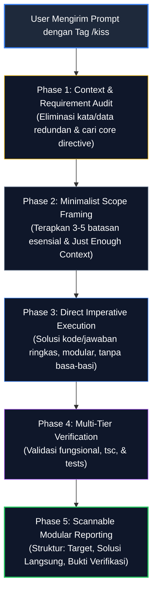

# KISS Protocol — Keep It Simple, Stupid (`/kiss`)

Protokol operasional dan penyederhanaan konteks berbasis prinsip **KISS** (*Keep It Simple, Stupid*). Workflow ini **hanya aktif secara eksklusif ketika user menyertakan tag atau perintah `/kiss`** dalam instruksinya.

Ketika diaktifkan, AI Agent wajib memangkas seluruh kompleksitas yang tidak perlu (*noise*), menyaring konteks hingga esensi murni (*signal-to-noise maximization*), dan mengeksekusi solusi paling ramping, langsung ke sasaran (*direct imperative*), tanpa *over-engineering* maupun verbositas.

---

## 🎯 Purpose & Activation Condition

> [!IMPORTANT]
> **EXPLICIT ACTIVATION ONLY**
> Workflow ini **HANYA AKTIF** jika user secara eksplisit menyertakan trigger `/kiss` (contoh: `/kiss [perintah]`, `/kiss tolong buatkan fungsi X`, atau `analisis modul ini /kiss`). 
> Jika tag `/kiss` tidak disertakan, agent beroperasi menggunakan mode workflow reguler.

### Tujuan Utama:
1. **Memaksimalkan Signal-to-Noise Ratio (SNR)**: Mengeliminasi basa-basi, kalimat klise, narasi berbelit, dan *raw dump* data yang tidak berpengaruh pada *output*.
2. **Mencegah Context Rot & Latensi**: Menjaga efisiensi token *context window*, mencegah halusinasi dari teks panjang yang kabur, serta mempercepat *turnaround time*.
3. **Penyederhanaan Eksekusi & Kode**: Mengutamakan solusi kode dan arsitektur yang minimalis, mudah dibaca, mudah diuji, dan minim dependensi redundan.

---

## 🔄 Workflow Lifecycle Diagram



---

## 🛡️ Core Rules & Guardrails

> [!IMPORTANT]
> **RULE 1: THE SIGNAL-TO-NOISE MANDATE**
> Hapus seluruh elemen percakapan pembuka yang tidak bernilai informasi (seperti *"Tentu, saya akan membantu Anda..."*, *"Berikut adalah penjelasan mendalam mengenai hal tersebut..."*). Langsung masuk ke fakta teknis, kode, atau aksi yang diminta.

> [!TIP]
> **RULE 2: JUST ENOUGH CONTEXT (JEC)**
> Hanya rujuk dan proses state atau data yang secara langsung memengaruhi keputusan dan luaran (*output*):
> - **Dilarang**: Menyalin seluruh riwayat percakapan atau ratusan baris file jika hanya 1 fungsi kecil yang menjadi target.
> - **Dianjurkan**: Ekstrak ringkasan intisari (*summary*), slice baris spesifik, atau parameter aktif yang sedang dimodifikasi.

> [!WARNING]
> **RULE 3: ZERO OVER-ENGINEERING (NO SPECULATIVE COMPLEXITY)**
> Jangan menambahkan lapisan abstraksi prematur (generics rumit tak berdasar, wrapper berantai, atau helper berlebih) untuk kebutuhan sederhana. Tulis implementasi paling langsung dan mudah dibaca yang menyelesaikan invariant masalah.

> [!NOTE]
> **RULE 4: SINGLE RESPONSIBILITY CHAINING**
> Satu paket interaksi/konteks hanya boleh melayani satu tugas spesifik. Jika instruksi user terlalu luas, pecah alurnya menjadi langkah berurutan (*chaining*) terpisah alih-alih menumpuknya dalam satu instruksi raksasa.

---

## ⚖️ Komparasi: Kompleksitas Berlebih vs. Prinsip KISS

| Aspek | Pendekatan Terlalu Rumit (Bloated) | Pendekatan KISS (`/kiss`) |
| :--- | :--- | :--- |
| **Gaya Bahasa** | Narasi panjang berbelit dengan banyak kalimat pembuka klise. | Instruksi langsung ke sasaran (*direct imperative*), scannable. |
| **Format Data** | Raw dump teks acak tanpa struktur yang jelas. | Data teringkas, terorganisasi dalam poin atau skema Markdown/JSON ringkas. |
| **Batasan (*Constraints*)** | Puluhan aturan tumpang tindih dan kontradiktif. | Tiga hingga lima batasan mutlak yang esensial. |
| **Arsitektur Kode** | Abstraksi berlebihan, wrapper berantai, generic rumit. | Fungsi lurus (*straightforward*), minim *indirection*, mudah diuji. |
| **Debugging** | Sulit di-*debug* akibat lapisan distraksi informasi (*noise*). | Titik kesalahan mudah dilacak, diisolasi, dan diverifikasi. |

---

## 🔄 Execution Phases

### Phase 1: Context & Prompt Audit
1. **Ekstrak Core Directive**: Identifikasi inti tugas setelah tag `/kiss`.
2. **Audit & Eliminasi Redundansi**: Lakukan tes eliminasi: *"Jika kalimat atau variabel ini dihapus, apakah keluarannya tetap sama?"* Jika ya, segera buang.
3. **Standardisasi Terminologi**: Gunakan istilah yang konsisten; hindari variasi sinonim yang memicu ambiguitas data.

### Phase 2: Minimalist Scope Framing
Formulasikan konteks kerja ke dalam blok modular ringkas:
- **Tujuan**: [Apa yang ingin dicapai dalam 1 kalimat presisi]
- **Batasan**: [3 hingga 5 batasan esensial yang tidak boleh dilanggar]
- **Data/Signature**: [Hanya interface, fungsi, atau parameter aktif yang relevan]

### Phase 3: Direct Imperative Implementation
1. Kerjakan solusi langsung ke target kode atau jawaban.
2. Terapkan prinsip kesederhanaan arsitektural: kode yang baik adalah kode yang paling sedikit barisnya namun memenuhi seluruh spesifikasi tanpa efek samping.
3. Hindari modifikasi file atau konfigurasi di luar cakupan langsung permintaan.

### Phase 4: Verification & Multi-Tier Audit
1. Jalankan verifikasi statis & dinamis sesuai target:
   ```bash
   bun x tsc --noEmit
   bun test
   ```
2. Pastikan tidak ada *dead code*, *console log* liar, atau artefak sementara yang tertinggal.

### Phase 5: Scannable Modular Reporting
Sajikan laporan kepada user dalam format terstruktur dan hemat token:
- **Hasil Inti**: 1-2 kalimat intisari dari perubahan yang dilakukan.
- **File Terdampak**: Link Markdown ke file terkait (`[file.ts](file:///path)`).
- **Status Verifikasi**: Status test suite dan type-check.

---

## 📋 Context Simplification Template

Gunakan kerangka ini untuk merumuskan instruksi atau menyajikan solusi di bawah protokol `/kiss`:

```markdown
### 🎯 Tujuan: [Tujuan spesifik dalam 1 kalimat]
### ⛔ Batasan:
- [Batasan 1]
- [Batasan 2]
### 📦 Data / Kontrak:
[Hanya tipe data atau parameter aktif]
### 🚀 Solusi:
[Implementasi langsung ke sasaran tanpa pengantar klise]
```

---

## 💡 Usage Examples

### Contoh 1: Refactoring Kode Ramping
```text
/kiss refactor fungsi calculateBitrate di src/lib/xclips/ytdlp-downloader.ts agar lurus tanpa nested if bertingkat
```

### Contoh 2: Pembuatan Fungsi / Komponen Baru
```text
/kiss buatkan utility formatCompactNumber(num: number): string (e.g. 1500 -> 1.5K)
```

### Contoh 3: Diagnosa & Fix Cepat
```text
/kiss kenapa activeTab di useStudioStore.ts ter-reset saat window resize? Berikan akar masalah dan solusinya langsung.
```

---

*KISS Protocol Workflow v1.0.0 — Updated 2026-09-04*
