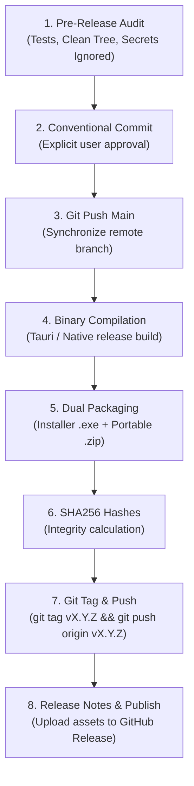

# Push and Release Protocol

A comprehensive, production-grade workflow for committing code, pushing to GitHub, tagging semantic releases, compiling desktop binaries (Installer & Portable), calculating cryptographic checksums, and publishing GitHub Releases.

---

## 🎯 Purpose

- **Zero-Friction Releasing**: Standardize the path from working code to a public GitHub release.
- **Dual-Artifact Distribution**: Ensure every desktop release provides both an **Installer** (`.exe`) and a **Portable Edition** (`.zip`).
- **Cryptographic & Git Hygiene**: Prevent leaking private keys/secrets and verify asset integrity with SHA256 hashes.
- **Consistent Documentation**: Automatically generate polished, Markdown-formatted release notes ready for GitHub Releases.

---

## 🧭 Flow Architecture



---

## 🛡️ Core Principles

> [!IMPORTANT]
> **1. EXPLICIT TRIGGER ONLY**
> Never push or publish without explicit confirmation from the user. Verify git status and check remotes before running push commands.

> [!CAUTION]
> **2. ZERO KEY LEAKS (CRITICAL)**
> Ensure all minisign keys (`*.key*`), PEM certificates, database files (`*.db`, `*.sqlite`), and `.env` files are in `.gitignore` and **NEVER** staged in git.

> [!TIP]
> **3. DUAL-DISTRIBUTION STANDARD**
> Always provide both:
> 1. **Setup Installer** (`AppName_<version>_x64-setup.exe`): For standard OS installation with Start Menu shortcuts.
> 2. **Portable ZIP** (`AppName_<version>_Portable_x64.zip`): Standalone executable that runs anywhere without installation.

---

## 📋 Step-by-Step Execution Phases

### Phase 1: Pre-Release Audit & Secret Protection
1. **Verify Git Status & Ignored Files**:
   ```powershell
   git status
   git status --ignored
   ```
   *Confirm that private keys (e.g. `*.key`, `*.pem`) and databases (`*.db`) are listed under Ignored Files.*

2. **Verify Code Integrity & Typechecking**:
   ```powershell
   # Frontend
   bun run build
   # Backend / Rust (if applicable)
   cargo check
   ```

---

### Phase 2: Staging, Commit & Push to Main
1. **Stage Allowed Files**:
   ```powershell
   git add .
   ```

2. **Create Consolidated Conventional Commit**:
   ```powershell
   git commit -m "feat(release): prepare vX.Y.Z release with CI/CD and docs"
   ```

3. **Push to Remote Main**:
   ```powershell
   git push -u origin main
   ```

---

### Phase 3: Binary Compilation & Packaging
1. **Compile Production Release**:
   ```powershell
   # For Tauri applications:
   bun run tauri:build
   ```

2. **Organize & Package Dual Artifacts**:
   Create a dedicated output directory `releases/vX.Y.Z/`:
   ```powershell
   pwsh -Command "
     $ver = 'v1.0.0';
     $rel = \"releases/$ver\";
     New-Item -ItemType Directory -Force -Path $rel | Out-Null;
     
     # 1. Copy Installer
     Copy-Item 'src-tauri/target/release/bundle/nsis/*-setup.exe' -Destination \"$rel/xDownloader_1.0.0_x64-setup.exe\";
     
     # 2. Compress Portable ZIP
     Compress-Archive -Path 'src-tauri/target/release/xdownloader.exe' -DestinationPath \"$rel/xDownloader_1.0.0_Portable_x64.zip\" -Force;
     
     Get-ChildItem $rel;
   "
   ```

---

### Phase 4: SHA256 Checksum Calculation
Generate checksums for tamper verification:

```powershell
Get-FileHash releases\vX.Y.Z\* | ForEach-Object { [System.IO.Path]::GetFileName($_.Path) + ': ' + $_.Hash }
```

---

### Phase 5: Tagging & Remote Synchronization
Create and push the semantic version tag to trigger GitHub Actions / tag references:

```powershell
git tag v1.0.0
git push origin v1.0.0
```

---

### Phase 6: Release Notes Generator & Asset Upload
1. **Open Release Folder**:
   ```powershell
   explorer.exe "releases\vX.Y.Z"
   ```

2. **Generate Release Body Template**:
   Provide the user with a ready-to-paste markdown template:

   ```markdown
   # ⚡ [AppName] v1.0.0 — [Title Summary]

   [Brief intro paragraph explaining the application and core tech stack]

   ---

   ## ✨ Key Features
   - 🎯 **Feature 1**: Description.
   - ✂️ **Feature 2**: Description.
   - 📋 **Feature 3**: Description.
   - 🗄️ **Feature 4**: Description.

   ---

   ## 📦 Download Options (Assets)

   | Release Type | File Name | Size | Recommendation |
   | :--- | :--- | :--- | :--- |
   | **Windows Installer** | `AppName_1.0.0_x64-setup.exe` | **~5 MB** | Standard setup with Start Menu integration. |
   | **Portable Edition** | `AppName_1.0.0_Portable_x64.zip` | **~7 MB** | Zero-install standalone executable. |

   ---

   ### 🔒 SHA256 Checksums
   ```text
   <HASH_INSTALLER>  AppName_1.0.0_x64-setup.exe
   <HASH_PORTABLE>   AppName_1.0.0_Portable_x64.zip
   ```
   ```

3. **Publishing**:
   - Direct user to: `https://github.com/<owner>/<repo>/releases/new?tag=vX.Y.Z`
   - Attach both `.exe` and `.zip` binaries.
   - Click **Publish release**.

---

## ⌨️ Usage

Execute via chat command:

```text
/push-and-release
/push-and-release --tag v1.0.0
/push-and-release --portable-only
```

Or trigger via natural language:
> *"Tolong push dan buatkan rilis versi v1.0.0"*
> *"Siapkan installer dan portable zip untuk GitHub release"*

---

*Push and Release Protocol v1.0.0 — Updated 2026-09-15*
