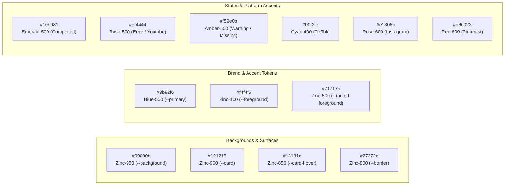
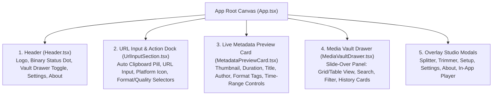

# DESIGN.md — xDownloader Design System & UI/UX Architecture

Dokumen ini mendefinisikan pedoman desain visual, palet warna, tipografi, arsitektur antarmuka desktop (*Studio Layout*), komponen reusable, dan efek kinetik antarmuka dalam **xDownloader**.

---

## 🎨 Design Philosophy: *Masagi Dark Precision*

Antarmuka **xDownloader** dirancang dengan filosofi **Pro-Grade Studio Workstation**:
1. **Dark-First Immersion**: Latar belakang hitam pekat (*Zinc-950*) mengurangi kelelahan mata, menghemat konsumsi energi layar OLED, serta membuat thumbnail media dan video preview menonjol secara estetis.
2. **High Information Density with Maximum Scannability**: Seluruh kontrol penting (URL input, platform indicator, format & quality selector, metadata card, download progress) dapat diakses dalam satu kanvas tanpa navigasi berlapis yang membingungkan.
3. **Micro-Feedback & Kinetic Dynamics**: Setiap aksi pengguna (paste link, auto-detect platform, streaming download progress, status binary) diperkuat dengan feedback visual instan, aksen glow halus, dan animasi light-trail border.
4. **Desktop Native Fluidity**: Menjaga respon antarmuka instan tanpa lag dengan pemanfaatan TailwindCSS v4, state modular di React 19, dan dialog native OS.

---

## 🌈 Color Palette & Design Tokens

Diimplementasikan melalui CSS custom properties pada `src/index.css` dan terintegrasi mulus dengan TailwindCSS v4:



### Palet Token Lengkap
| Token CSS | Hex Code | Peran & Penggunaan |
| :--- | :--- | :--- |
| `--background` | `#09090b` | Base canvas background seluruh window aplikasi desktop |
| `--card` | `#121215` | Latar belakang panel input, metadata card, modal dialog, drawer |
| `--card-hover` | `#18181c` | State hover pada kartu media vault dan dropdown menu |
| `--border` | `#27272a` | Garis batas (*border*) container, input box, dan divider |
| `--border-hover`| `#3f3f46` | State hover border pada kartu dan input kontrol |
| `--primary` | `#3b82f6` | Warna aksen utama tombol aksi, focus rings, dan active state |
| `--primary-hover`| `#2563eb` | Hover state tombol utama |
| `--foreground` | `#f4f4f5` | Teks judul utama dan nilai informasi penting |
| `--muted-foreground` | `#71717a` | Teks keterangan sekunder, timestamp, dan placeholder |
| `--destructive` | `#ef4444` | Tombol batal, konfirmasi hapus, status error |

---

## 📐 Desktop Studio UI Architecture

Antarmuka **xDownloader** dirancang dalam struktur komponen terpadu:



### 1. Header Navigation Bar
- Menampilkan branding **xDownloader** dengan aksen gradient aurora kinetik.
- **Engine Status Indicator**: Badge indikator binary engine (`yt-dlp` & `ffmpeg`) dengan lampu hijau/merah yang dapat diklik untuk membuka modal binary setup.
- **Media Vault Trigger**: Tombol pembuka drawer riwayat unduhan lengkap dengan badge counter jumlah media tersimpan.
- **Quick Action Triggers**: Akses cepat ke Settings Modal dan About Modal.

### 2. URL Input Section & Action Dock
- **Smart Clipboard Banner**: Secara otomatis mendeteksi jika pengguna menyalin link video yang didukung dan menyediakan tombol instan *"Paste & Fetch"*.
- **Multi-URL Detection**: Mendukung ekstraksi tautan tunggal maupun batch URL dari input teks.
- **Platform Badge**: Menampilkan logo platform secara otomatis (YouTube, TikTok, Instagram, X/Twitter, Pinterest, Web Media).
- **Format & Quality Dock**:
  - Format Selector: Pilihan instan antara `Video`, `Audio`, `Image`, dan `Subtitles`.
  - Quality Dropdown: Pilihan resolusi dari `4K (2160p)` hingga `360p`, serta format audio (`MP3`, `M4A`, `WAV`, `FLAC`).
- **Studio Action Buttons**:
  - Tombol **Download Now** (dengan progress bar real-time saat berjalan).
  - Tombol **Split Video** (membuka modal pemecah video).
  - Tombol **Trim Video** (membuka modal pemotong durasi video).

### 3. Metadata Preview Card
- Menampilkan pratinjau media setelah link diinput:
  - Thumbnail visual resolusi tinggi dengan durasi overlay di pojok bawah.
  - Judul media, channel/pembuat konten, dan platform source pill.
  - Tag ringkasan format dan resolusi yang dipilih.
  - **Partial Download Range**: Bagian ekspansi untuk mengatur start & end timecode (`HH:MM:SS`) jika pengguna hanya ingin mengunduh potongan tertentu.

### 4. Media Vault Drawer (Slide-Over Panel)
- Panel geser kanan (*slide-over drawer*) dengan backdrop blur yang menampilkan seluruh aset yang telah diunduh ke SQLite lokal:
  - **Segmented View Toggle**: Beralih antara **Grid View** (kartu visual interaktif) dan **Table View** (tabel detail kompak).
  - **Search & Filter**: Pencarian real-time berdasarkan judul/author dan filter cepat per platform atau tipe format.
  - **Action Quick Bar**:
    - Putar langsung di *In-App Media Preview Player*.
    - Buka file di Windows File Explorer (`open_in_explorer`).
    - Kirim media yang sudah diunduh ke Video Splitter atau Video Trimmer.
    - Hapus record dari database (dan deteksi file hilang otomatis).

### 5. Dedicated Studio Modals
- **VideoSplitterModal**: Membagi video lokal atau online stream berdasarkan durasi tetap (misal: 60 detik), jumlah part merata, atau rentang custom.
- **VideoTrimmerModal**: Pemotongan presisi milidetik dengan preview timeline interaktif dan timecode editor.
- **BinarySetupModal**: Panduan status binary `yt-dlp` & `ffmpeg` dengan tombol One-Click Auto Installer.
- **MediaPreviewModal**: Pemutar media bawaan untuk memutar video, audio, atau menampilkan foto beresolusi penuh tanpa perlu membuka media player eksternal.
- **SettingsModal**: Pengaturan folder download default, kualitas default, auto clipboard listener, dan engine updater.
- **AboutModal**: Informasi aplikasi, lisensi, dan pengecekan pembaruan via `tauri-plugin-updater`.

---

## ✨ Kinetic Animations & Visual Effects

xDownloader menggunakan animasi CSS GPU-accelerated murni yang didefinisikan di `src/index.css`:

### 1. Aurora Gradient Title (`title-animated-gradient`)
Animasi gradien dinamis yang mengalir halus pada judul aplikasi, menggabungkan rona slate, sky blue, dan violet lembut:
```css
@keyframes text-aurora {
  0% { background-position: 0% 50%; }
  50% { background-position: 100% 50%; }
  100% { background-position: 0% 50%; }
}
```

### 2. Light Trail Animated Border (`light-trail-container`)
Efek garis cahaya berputar (*light trail outline*) di sekitar kartu dan input utama saat aktif, memberikan nuansa futuristik pro-grade tanpa mengalihkan fokus pengguna:
```css
@keyframes light-trail {
  0% { transform: rotate(0deg); }
  100% { transform: rotate(360deg); }
}
```

### 3. Ambient Glow Aura (`title-glow-aura`)
Pendaran ambient halus di belakang header untuk menciptakan kedalaman visual (*layer depth*) pada latar belakang hitam pekat.

---

## 🧩 Component Styling Standards

- **Helper Utility**: Selalu gunakan helper `cn(...)` dari `@/lib/utils.ts` untuk penggabungan class Tailwind:
  ```typescript
  import { cn } from "@/lib/utils";
  
  <button className={cn(
    "px-4 py-2 rounded-lg font-medium transition-all duration-200",
    "bg-primary hover:bg-primary-hover text-white shadow-sm",
    "focus:outline-none focus:ring-2 focus:ring-blue-500/30",
    disabled && "opacity-50 cursor-not-allowed"
  )}>
    Download
  </button>
  ```
- **Larangan Keras**: Dilarang mengimpor atau menambahkan pustaka komponen pihak ketiga seperti Material UI (MUI), Ant Design, atau Chakra UI. Seluruh komponen harus berbasis TailwindCSS v4 native.

---

*xDownloader Design System Reference v1.0.0 — Updated 2026-09-17*
