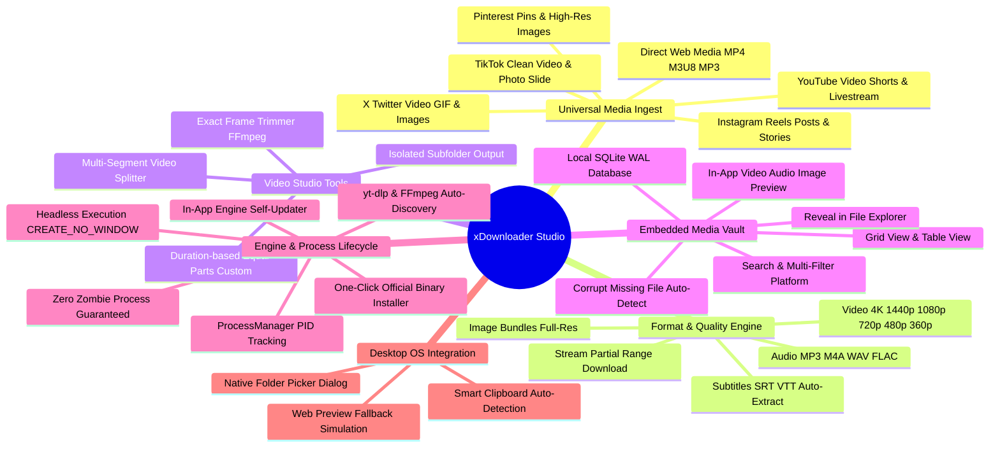

# FEATURES.md — xDownloader Functional Catalog & Feature Specifications

Dokumen ini memuat katalog lengkap fitur, alur kerja teknis (*media pipelines*), spesifikasi implementasi fungsional, dan matriks kapabilitas dalam **xDownloader**.

---

## 🗺️ Functional Feature Map

---

## 🎯 8 Core Feature Modules

### 1. Universal Multi-Platform Media Ingest
- **YouTube**:
  - Mendukung video standar, YouTube Shorts, unlisted videos, dan VOD livestreams.
  - Opsi download subtitel bawaan atau auto-generated (`en`, `id`).
- **TikTok**:
  - Mengunduh video TikTok tanpa watermark (*clean video*).
  - Ekstraksi foto slide (carousel album) sebagai bundle file gambar beresolusi penuh.
- **Instagram**:
  - Mengunduh Instagram Reels, video feed, dan multi-image carousel posts.
- **X (Twitter)**:
  - Ekstraksi video, klip animasi GIF, dan foto tweet resolusi tinggi.
- **Pinterest**:
  - Ekstraksi video pin dan foto resolusi asli langsung dari CDN Pinterest (`i.pinimg.com`).
- **Direct / Generic Web Media**:
  - Mendukung URL media langsung (`.mp4`, `.webm`, `.mov`, `.mp3`, `.wav`, `.m3u8`, `.m4a`).

---

### 2. Native Format & Quality Matrix

| Kategori | Format / Pilihan | Keterangan Teknis |
| :--- | :--- | :--- |
| **Video Quality** | `best`, `4k`, `1440p`, `1080p`, `720p`, `480p`, `360p` | Seleksi stream adaptif via `yt-dlp` (`bestvideo[height<=...]+bestaudio/best`) digabung otomatis ke MP4. |
| **Audio Extraction** | `mp3`, `m4a`, `wav`, `flac` | Ekstraksi track audio murni dengan konversi FFmpeg berkualitas tinggi (320kbps untuk MP3, lossless untuk WAV/FLAC). |
| **Subtitles** | `srt`, `vtt` | Mengunduh track subtitel manual atau auto-generated (`--write-subs`, `--write-auto-subs`, `--convert-subs srt`). |
| **Image Extraction** | `jpg`, `png`, `webp` | Pengambilan gambar langsung dari CDN tanpa kompresi berlebih. |
| **Partial Stream Download** | Range: `HH:MM:SS` s/d `HH:MM:SS` | Mengunduh hanya segmen tertentu langsung dari stream online via argumen `--download-sections *START-END` tanpa memboroskan kuota/waktu. |

---

### 3. In-App Exact Video Trimmer (FFmpeg)
- **Kapabilitas**:
  - Memotong awal dan akhir video dengan presisi milidetik.
  - Mendukung **Local Video** (file yang sudah ada di PC) dan **Online Stream URL** (potong langsung saat mengunduh).
- **Pipeline Teknis**:
  - Menggunakan fast seeking (`-ss`) digabungkan dengan output seeking (`-to`).
  - Opsi direct stream copy (`-c copy`) untuk pemotongan instan tanpa penurunan kualitas, atau re-encoding jika dibutuhkan akurasi keyframe absolut.
- **Visual Feedback**:
  - Pratinjau video interaktif dengan timecode input, slider durasi, indikator estimasi output, dan progress bar real-time.

---

### 4. Multi-Segment Video Splitter (FFmpeg)
- **Mode Pemecahan**:
  1. **By Fixed Duration**: Memecah video panjang menjadi potongan-potongan berdurasi sama (misal: setiap 30 detik atau 60 detik untuk TikTok, IG Reels, atau YouTube Shorts).
  2. **By Equal Parts**: Membagi total durasi video secara merata ke dalam $N$ bagian (misal: 2, 3, 5 bagian).
  3. **Custom Segments**: Menentukan rentang manual per part dengan label khusus (misal: Part 1: 00:00-01:30, Part 2: 01:30-04:00).
- **Otomatisasi**:
  - `create_subfolder`: Secara otomatis membuat folder khusus untuk menyimpan seluruh segmen yang dihasilkan agar rapi.
  - Penomoran otomatis: Format penamaan terstruktur (`{title}_part01.mp4`, `{title}_part02.mp4`).

---

### 5. Embedded Media Vault (Local Asset History)
- **Penyimpanan Lokal**:
  - Menggunakan SQLite embedded dengan mode WAL (`vault.db`), memastikan performa baca-tulis tinggi tanpa locking UI.
- **Tampilan Fleksibel**:
  - **Grid View**: Tampilan kartu visual interaktif dengan thumbnail, platform badge, durasi, dan ukuran file.
  - **Table View**: Tampilan tabel kompak dengan informasi teknis padat (URL, status, path file, waktu unduh).
- **Fitur Vault**:
  - Pencarian instan (*instant search*) berdasarkan judul, pengunggah, atau link sumber.
  - Filter kategori berdasarkan platform (YouTube, TikTok, Instagram, X, Pinterest, Generic) dan format (Video, Audio, Image).
  - Aksi instan: Buka folder di Windows Explorer (`open_in_explorer`), putar di In-App Preview Modal, atau kirim ke Video Splitter/Trimmer.
  - Deteksi file corrupt/hilang: Jika file fisik telah dipindahkan/dihapus dari harddisk, record ditandai `exists: false` dan dapat dibersihkan langsung tanpa konfirmasi ganda.

---

### 6. Binary Engine Management & One-Click Setup
- **Deteksi Binary Otomatis**:
  - Mendeteksi keberadaan `yt-dlp`, `ffmpeg`, dan `ffprobe` secara otomatis pada folder aplikasi (`./bin`), folder data pengguna (`%APPDATA%/xdownloader/bin`), atau system `PATH`.
- **One-Click Auto Setup**:
  - Jika binary belum tersedia, pengguna cukup menekan satu tombol. Backend Rust secara otomatis mengunduh rilis resmi terverifikasi dari GitHub, mengekstrak, dan menempatkannya ke direktori bin internal.
- **In-App Engine Self-Updater**:
  - Tombol update di antarmuka Settings untuk memperbarui engine `yt-dlp` ke rilis terbaru (`yt-dlp -U`) guna mengatasi perubahan enkripsi atau layout platform streaming.

---

### 7. Process Safety & Zero-Zombie Guarantee
- **ProcessManager Tracking**:
  - Setiap eksekusi proses eksternal (`yt-dlp`, `ffmpeg`) dicatat bersama PID uniknya ke dalam memory table thread-safe `ProcessManager`.
- **Clean Process Tree Termination**:
  - Pembatalan unduhan tidak hanya menutup stream stdout, melainkan memanggil `taskkill /F /T /PID <pid>` pada Windows untuk mematikan seluruh pohon proses (parent dan child subprocess) seketika.
- **Headless Execution**:
  - Seluruh pemanggilan binary menggunakan flag `CREATE_NO_WINDOW (0x08000000)` agar tidak pernah memunculkan jendela konsol hitam CMD/PowerShell di layar pengguna.

---

### 8. Smart Clipboard & Native Desktop Integration
- **Auto Clipboard Detect**:
  - Memonitor clipboard pengguna secara non-intrusif menggunakan `tauri-plugin-clipboard-manager`.
  - Saat link media valid disalin, aplikasi menampilkan banner kontekstual untuk paste otomatis dalam satu klik.
- **Native OS Dialogs**:
  - Pemilihan folder output menggunakan dialog bawaan Windows via `tauri-plugin-dialog`.
- **Web Preview Resilience**:
  - Saat dijalankan di browser web di luar Tauri (`bun run dev`), seluruh API menyediakan mock simulation interaktif sehingga pengembangan UI tetap dapat dilakukan tanpa kompilasi Rust.

---

## 📊 Feature Status & Verification Matrix

| Modul Fitur | Status Implementasi | Verifikasi & Validasi |
| :--- | :---: | :--- |
| **YouTube Downloader (Video/Audio/Subs)** | ✅ Production | E2E Native Tauri + IPC |
| **TikTok & Instagram Downloader** | ✅ Production | E2E Native Tauri + IPC |
| **X (Twitter) & Pinterest Media/Image** | ✅ Production | Rust Unit Tests (`image_extractor::tests`) |
| **Video Exact Trimmer (FFmpeg)** | ✅ Production | E2E Native Tauri + IPC |
| **Multi-Segment Video Splitter (FFmpeg)** | ✅ Production | E2E Native Tauri + IPC |
| **Media Vault (SQLite WAL)** | ✅ Production | SQLite Migrations & Rust Queries |
| **One-Click Binary Setup & Updater** | ✅ Production | E2E Download & `binaries.rs` |
| **Smart Clipboard Listener** | ✅ Production | Tauri Clipboard Plugin Integration |
| **Web Preview Simulation Mode** | ✅ Production | Frontend Build & Browser Preview |

---

*xDownloader Features Catalog v1.0.0 — Updated 2026-09-17*
